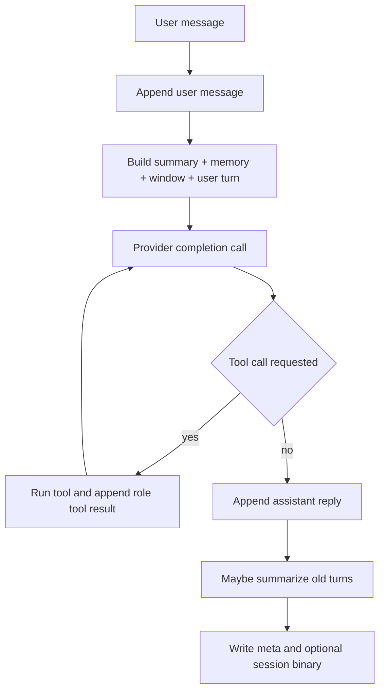

# Getting started (consumer app)

`local-ai-sdk` is a local-first LLM runtime for React Native (`llama.rn`) with split entrypoints.

## Entrypoints

- `local-ai-sdk` - core engine (RN-safe)
- `local-ai-sdk/react` - React hook (`useLocalChat`)
- `local-ai-sdk/llama` - llama.rn provider
- `local-ai-sdk/models/node` - Node/Desktop model downloads
- `local-ai-sdk/models/rn` - RN/Expo adapter-based downloads

## What this package is

`local-ai-sdk` is an on-device runtime layer, not a cloud orchestration SDK.
It manages conversation state, tool execution flow, optional memory retrieval, and session persistence around `llama.rn`.

## Installation matrix

Install by usage path instead of installing everything by default.

| You use | Install |
| --- | --- |
| Core engine + llama provider in RN app | `npm install local-ai-sdk llama.rn react-native expo` |
| React hook (`useLocalChat`) | `npm install local-ai-sdk react` |
| Node/Desktop download helper | `npm install local-ai-sdk` |
| RN adapter-based downloads (Expo/blob-util) | `npm install local-ai-sdk expo-file-system` or `npm install local-ai-sdk react-native-blob-util` |

Runtime matrix:

- `expo >= 53`
- `react-native >= 0.79`
- `llama.rn >= 0.10.0`
- `react >= 19` only for `local-ai-sdk/react`

## Minimal React Native example

```ts
import { createEngine, defineTool } from 'local-ai-sdk';
import { createLlamaRNProvider } from 'local-ai-sdk/llama';

const provider = createLlamaRNProvider({
  modelPath: 'file:///absolute/path/model.gguf',
  contextSize: 4096,
  n_gpu_layers: 99,
  embedding: true,
});

const engine = createEngine({
  provider,
  systemPrompt: 'You are a helpful on-device assistant.',
  tools: [
    defineTool({
      name: 'ping',
      description: 'Returns pong',
      parameters: { type: 'object', properties: {}, additionalProperties: false },
      execute: () => ({ pong: true }),
    }),
  ],
});

await engine.init();
await engine.sendMessage('Hello');
```

## How a turn is executed



## Node/Desktop model download

```ts
import { downloadModel } from 'local-ai-sdk/models/node';
```

## React Native / Expo large-file download

```ts
import * as FileSystem from 'expo-file-system';
import { createExpoFileSystemAdapter, downloadModelWithAdapter } from 'local-ai-sdk/models/rn';
```

## Session metadata (React Native)

Binary KV lives at `session.path`. Chat UI state is JSON at `${session.path}.meta.json` by default. Pass `session.storage` with read/write/delete/exists backed by your FS module (Expo, RNFS, etc.). If available, implement `writeTextAtomic(path, data)` for crash-safe metadata writes.

For RN vector backend bootstrap, set `memory.rnVectorBackend` with backend `op-sqlite` or `expo-vector-search`.
Current behavior is explicit: backend availability check at runtime, then in-memory vector fallback.

## See also

- [Model API](./api/models.md)
- [Llama adapter API](./api/llama.md)
- [Publishing](./PUBLISHING.md)
