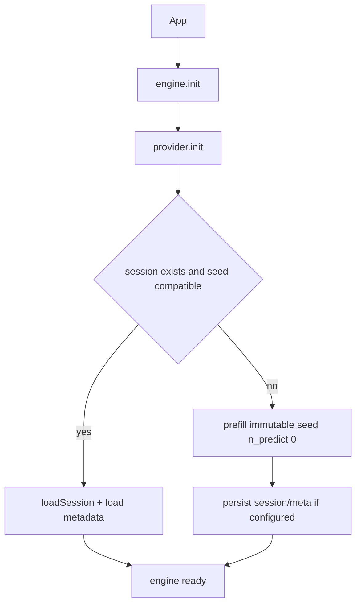
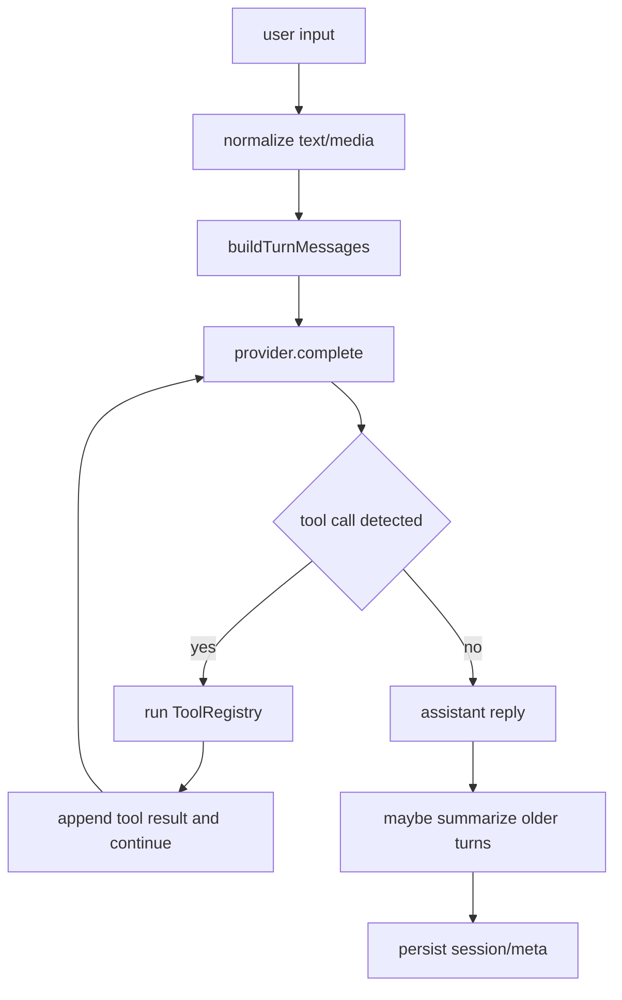

# Architecture

## Runtime components

The V0.0.0 baseline is built around `LocalFirstEngine`, which orchestrates:

1. **Provider lifecycle** (`init`, `complete`, `save/loadSession`, `dispose`)
2. **Turn construction** (`summary -> recalled memory -> sliding window -> user turn`)
3. **Tool execution loop** (`native` or `json` mode)
4. **Session persistence** (binary KV + JSON metadata)
5. **Optional memory recall** via vector search

## Lifecycle flow

## Message flow for a turn

## Tool modes

- `native`
  - Sends tool schemas through `tools` + `tool_choice: auto`.
  - Provider returns `assistant` messages with `tool_calls` (native function-calling contract).
  - Engine executes each call locally, then appends `tool` role responses with `tool_call_id`.
  - If a tool fails (invalid args, unknown tool, runtime error), the engine appends a structured tool error payload instead of aborting the whole turn.
- `json`
  - Expects assistant JSON shaped like `{"tool_call":{"name","args"}}`.
  - Engine synthesizes an `assistant` tool-call message, then injects a `tool` role response (same role semantics as native mode), and reruns generation.
  - If a tool fails, the engine injects a structured tool error payload and continues generation.

## Tool call vocabulary

- **Native tool call**: an `assistant` message carrying `tool_calls` from provider output.
- **Tool result message**: a `role: tool` message carrying the JSON-serialized result for one call (success or error), linked with `tool_call_id`.

## Persistence model

- Session binary file at `session.path` is saved/loaded through provider methods.
- Metadata JSON stores:
  - `summary`
  - `messages`
  - `logicalTurnCount`
  - `seedHash`
- Seed compatibility is enforced with a deterministic fingerprint of prompt + tool schema + tool mode + optional extras.

## Memory and summarization

- `remember` embeds memory text and upserts into vector storage.
- `recall` embeds query, searches top-k hits, returns hits + formatted context block.
- Summarization compacts older dialogue after threshold pressure and keeps only a recent window in active state.
