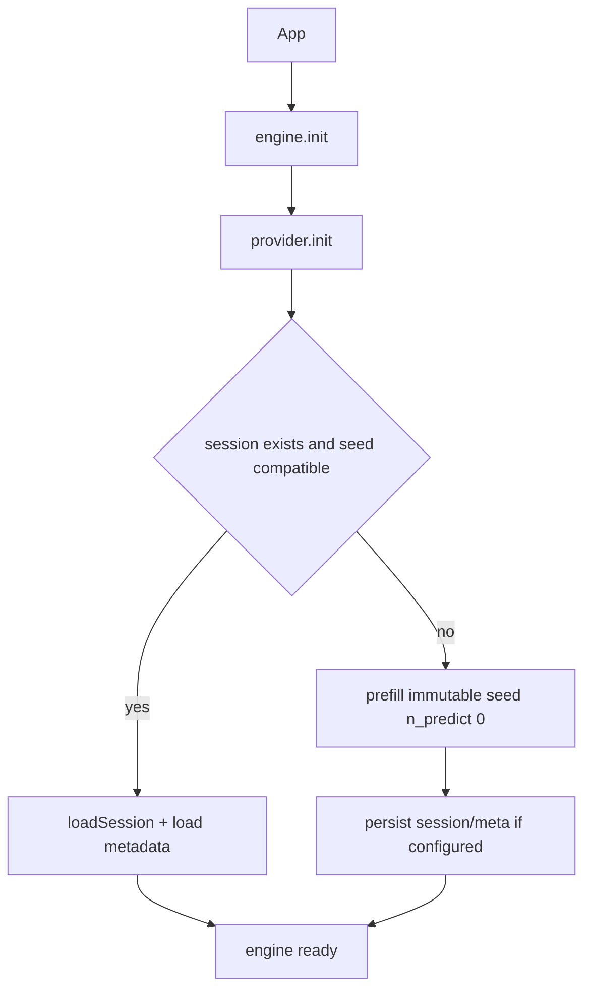
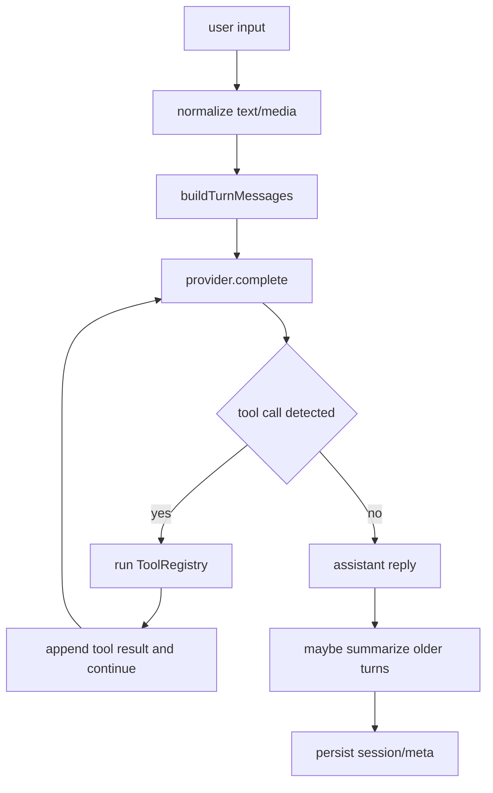

# Architecture

## Runtime components

The V0.0.0 baseline is built around `LocalFirstEngine`, which orchestrates:

1. **Provider lifecycle** (`init`, `complete`, `save/loadSession`, `dispose`)
2. **Turn construction** (`summary -> recalled memory -> sliding window -> user turn`)
3. **Tool execution loop** (`native` or `json` mode)
4. **Session persistence** (binary KV + JSON metadata)
5. **Optional memory recall** via vector search

## Lifecycle flow

## Message flow for a turn

## Tool modes

- `native`
  - Sends tool schemas through `tools` + `tool_choice: auto`.
  - Executes returned `tool_calls`.
  - Appends `tool` role responses and continues until final assistant text.
- `json`
  - Expects assistant JSON shaped like `{"tool_call":{"name","args"}}`.
  - Executes tool locally, injects result as follow-up message, and reruns generation.

## Persistence model

- Session binary file at `session.path` is saved/loaded through provider methods.
- Metadata JSON stores:
  - `summary`
  - `messages`
  - `logicalTurnCount`
  - `seedHash`
- Seed compatibility is enforced with a deterministic fingerprint of prompt + tool schema + tool mode + optional extras.

## Memory and summarization

- `remember` embeds memory text and upserts into vector storage.
- `recall` embeds query, searches top-k hits, returns hits + formatted context block.
- Summarization compacts older dialogue after threshold pressure and keeps only a recent window in active state.
