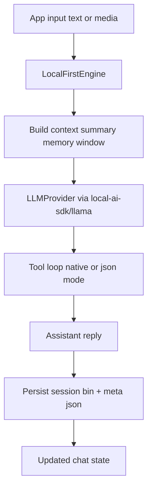

# local-ai-sdk Documentation

`local-ai-sdk` is a **local-first LLM runtime for React Native (`llama.rn`)**.

## What this runtime provides

- Stateful on-device runtime for LLM workflows.
- Keeps a persistent conversation state with:
  - immutable seed prefill
  - optional KV session persistence
  - JSON metadata persistence (summary + message window)
- Supports **tool calling** with two modes:
  - `native` tool calls (`CompletionResult.tool_calls: NativeToolCall[]`)
  - `json` fallback tool calls (`{"tool_call": ...}`), normalized into the same assistant `tool_calls` + `role: tool` result flow
- Supports optional memory/RAG primitives:
  - `embed`
  - `remember`
  - `recall`
- Supports multimodal user input (`text`, `image`, `audio`) through provider-compatible message parts.

## Runtime overview

## Package layout and entrypoints

- `local-ai-sdk` - RN-safe core engine/runtime surface
- `local-ai-sdk/react` - React binding (`useLocalChat`)
- `local-ai-sdk/llama` - llama.rn provider adapter
- `local-ai-sdk/models/node` - Node/Desktop download helpers
- `local-ai-sdk/models/rn` - RN/Expo adapter-based download helpers

## Start here

- [Architecture](./architecture.md): runtime model and message flow
- [Core Engine API](./api/core-engine.md): `createEngine`, `LocalFirstEngine`
- [Types](./api/types.md): all major configuration and data contracts
- [Provider Contracts](./api/providers.md): provider interface and completion payloads
- [React Bindings API](./api/react.md): `useLocalChat` hook contract
- [Llama Adapter API](./api/llama.md): `createLlamaRNProvider`
- [Model Download API](./api/models.md): download + adapter helpers
- [Examples](./examples/basic-chat.md): end-to-end integration examples
- [Versioning Note](./versioning.md): baseline guarantee details
